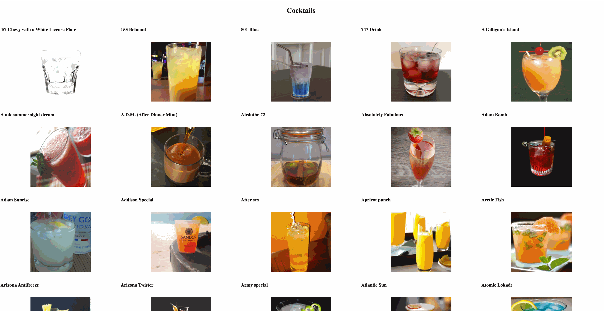

1. Open a terminal tab, and run `npm install` to download the dependenices.
2. In that same tab (after completion), run `npm start` to start your node server.
3. In a **NEW** terminal tab, run `npm run build` to start Webpack, which will watch and auto-transpile your files (using Babel). *Make sure this tab remains running*.
4. Open up a chrome tab at `localhost:3001` to see your code being rendered.

----
## Overview of this repo

* With this project, we will be creating an application that will display a list of cocktails made with a searched ingredient.

* Our task is to build out functionalities to **render** a default list of cocktails, **add**  cocktails to a favorites list, and **remove** cocktails from our favorites. *Let's get started!*

----
## Checklist of Features to Complete

### Step 1: Connect your React app to the browser, using `index.js`

* Render `App.jsx` to our `index.html`.

----
### Step 2: Start writing out `App.jsx` component

* Create **App**, as a *stateful/class* component.
* Create a piece of state to store an array of drinks, which will be used to render a list of cocktails.
* Render the **List** component inside of the **App** component.

----
### Step 3: Write out `List.jsx` and `ListItem.jsx`

* Create both **List** and **ListItem** as *functional* components.
* Connect the two components (in React style), using the comments at the top of each file as a guideline.

> Leave this hard-coded for now; we will refactor momentarily.

----
### Step 4: Check your work

* Make sure you are able to see the hard-coded **List** and **ListItems** in your browser.

----
### Step 5: Refactor `List.jsx` and `ListItems.jsx` for variable data

* Import the static drink data from `dummy.js` and have `App.jsx` set its state once the page is loaded
*  **List** should render one **ListItem** for each drink in the array in **App**'s state
* **ListItem** components should be able to conditionally render the drink's `strDrink` (name), and `strDrinkThumb` (thumbnail image) based on what is passed down to it via `props`.

----
### Step 6: Check your work

* Set **App**'s state to a real list of cocktails, by importing and using `dummy.js`
* You should see a rendered list of cocktails, with their name and image displayed.

----
### Stretch Goal 1: Write out `Favorites.jsx`

* Create **Favorites** as a *functional* component
* Update app's state to store a list of favorite drinks

----
### Stretch Goal 2: Add favorite functionality to `App.jsx`

* When a `ListItem` is clicked, it should be added to the favorites list and rendered on the page.

### Stretch Goal 3: Add functionality to remove favorites to `App.jsx`

* When a `favorite` is clicked, it should be removed from the favorites list in state and the page should rerender accordingly.

**Further steps to test your abilities are to come!**